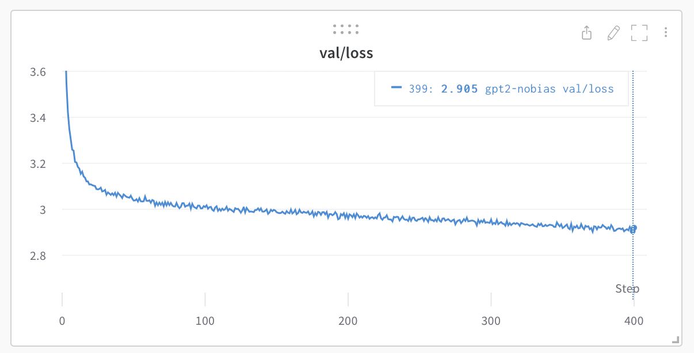

# nanoGPT


最简单、最快速的中型 GPT 训练/微调仓库。这是 [minGPT](https://github.com/karpathy/minGPT) 的重写版本，更注重实用性而非教育性。目前仍在积极开发中，但 `train.py` 文件已经可以在单个 8XA100 40GB 节点上用约 4 天时间在 OpenWebText 数据集上复现 GPT-2 (124M)。代码本身简洁易读：`train.py` 是约 300 行的样板训练循环，`model.py` 是约 300 行的 GPT 模型定义，可以选择性地加载 OpenAI 的 GPT-2 权重。就是这样。



由于代码非常简单，因此很容易根据您的需求进行修改，从头开始训练新模型，或微调预训练检查点（例如，目前可用的最大起点是 OpenAI 的 GPT-2 1.3B 模型）。

## 安装

```
pip install torch numpy transformers datasets tiktoken wandb tqdm
```

依赖项：

- [pytorch](https://pytorch.org) <3
- [numpy](https://numpy.org/install/) <3
-  `transformers` 用于 huggingface transformers <3（加载 GPT-2 检查点）
-  `datasets` 用于 huggingface datasets <3（如果你想下载和预处理 OpenWebText）
-  `tiktoken` 用于 OpenAI 的快速 BPE 编码 <3
-  `wandb` 用于可选的日志记录 <3
-  `tqdm` 用于进度条 <3

## 快速开始

如果你不是深度学习专家，只是想感受一下魔力，入门的最快方法是在莎士比亚作品上训练一个字符级 GPT。首先，我们将其下载为单个（1MB）文件，并将原始文本转换为一个大的整数流：

```sh
python data/shakespeare_char/prepare.py
```

这会在该数据目录中创建 `train.bin` 和 `val.bin`。现在是时候训练你的 GPT 了。它的大小在很大程度上取决于系统的计算资源：

**我有 GPU**。太好了，我们可以使用 [config/train_shakespeare_char.py](config/train_shakespeare_char.py) 配置文件中提供的设置快速训练一个小型 GPT：

```sh
python train.py config/train_shakespeare_char.py
```

如果你查看里面的内容，你会看到我们正在训练一个上下文大小为 256 个字符、384 个特征通道的 GPT，它是一个 6 层的 Transformer，每层有 6 个注意力头。在一个 A100 GPU 上，这次训练运行大约需要 3 分钟，最佳验证损失为 1.4697。根据配置，模型检查点被写入 `--out_dir` 目录 `out-shakespeare-char`。所以一旦训练完成，我们可以通过将采样脚本指向该目录来从最佳模型中采样：

```sh
python sample.py --out_dir=out-shakespeare-char
```

这会生成一些样本，例如：

```
ANGELO:
And cowards it be strawn to my bed,
And thrust the gates of my threats,
Because he that ale away, and hang'd
An one with him.

DUKE VINCENTIO:
I thank your eyes against it.

DUKE VINCENTIO:
Then will answer him to save the malm:
And what have you tyrannous shall do this?

DUKE VINCENTIO:
If you have done evils of all disposition
To end his power, the day of thrust for a common men
That I leave, to fight with over-liking
Hasting in a roseman.
```

哈哈 `¯\_(ツ)_/¯`。对于一个在 GPU 上训练 3 分钟的字符级模型来说还不错。通过在此数据集上微调预训练的 GPT-2 模型，很可能获得更好的结果（稍后请参阅微调部分）。

**我只有一台 macbook**（或其他便宜的电脑）。别担心，我们仍然可以训练 GPT，但我们需要降低一些要求。我建议使用最新的 PyTorch nightly 版本（[在此处选择](https://pytorch.org/get-started/locally/)安装），因为它目前很可能会使你的代码更高效。但即使没有它，一个简单的训练运行可能如下所示：

```sh
python train.py config/train_shakespeare_char.py --device=cpu --compile=False --eval_iters=20 --log_interval=1 --block_size=64 --batch_size=12 --n_layer=4 --n_head=4 --n_embd=128 --max_iters=2000 --lr_decay_iters=2000 --dropout=0.0
```

在这里，由于我们在 CPU 而不是 GPU 上运行，我们必须设置 `--device=cpu`，并且还要使用 `--compile=False` 关闭 PyTorch 2.0 编译。然后在评估时，我们得到的估计更嘈杂但更快（`--eval_iters=20`，从 200 降低），我们的上下文大小只有 64 个字符而不是 256，批量大小每次迭代只有 12 个样本，而不是 64。我们还将使用更小的 Transformer（4 层、4 个头、128 嵌入大小），并将迭代次数减少到 2000（并相应地通常使用 `--lr_decay_iters` 将学习率衰减到 max_iters 附近）。因为我们的网络如此之小，我们还减轻了正则化（`--dropout=0.0`）。这仍然运行大约 3 分钟，但我们的损失只有 1.88，因此样本也更差，但仍然很有趣：

```sh
python sample.py --out_dir=out-shakespeare-char --device=cpu
```
生成这样的样本：

```
GLEORKEN VINGHARD III:
Whell's the couse, the came light gacks,
And the for mought you in Aut fries the not high shee
bot thou the sought bechive in that to doth groan you,
No relving thee post mose the wear
```

对于在 CPU 上约 3 分钟的训练来说还不错，至少有正确字符的一些感觉。如果你愿意等待更长时间，请随意调整超参数，增加网络大小、上下文长度（`--block_size`）、训练时长等。

最后，在 Apple Silicon Macbook 上并使用最新的 PyTorch 版本时，请确保添加 `--device=mps`（"Metal Performance Shaders"的缩写）；PyTorch 将使用片上 GPU，可以*显著*加速训练（2-3 倍）并允许你使用更大的网络。更多信息请参见 [Issue 28](https://github.com/karpathy/nanoGPT/issues/28)。

## 复现 GPT-2

更认真的深度学习专业人士可能更感兴趣于复现 GPT-2 结果。那么我们开始吧 - 我们首先对数据集进行标记化，在本例中是 [OpenWebText](https://openwebtext2.readthedocs.io/en/latest/)，这是 OpenAI（私有）WebText 的开放复现版本：

```sh
python data/openwebtext/prepare.py
```

这会下载并标记化 [OpenWebText](https://huggingface.co/datasets/openwebtext) 数据集。它将创建 `train.bin` 和 `val.bin`，其中保存 GPT2 BPE token id 的一个序列，以原始 uint16 字节存储。然后我们准备开始训练。要复现 GPT-2 (124M)，你至少需要一个 8X A100 40GB 节点并运行：

```sh
torchrun --standalone --nproc_per_node=8 train.py config/train_gpt2.py
```

这将使用 PyTorch 分布式数据并行（DDP）运行约 4 天，损失将降至约 2.85。现在，仅在 OWT 上评估的 GPT-2 模型的验证损失约为 3.11，但如果你对其进行微调，它将降至约 2.85 的范围（由于明显的域差距），使两个模型大致匹配。

如果你在集群环境中，并且拥有多个 GPU 节点，你可以让 GPU 飞转，例如跨 2 个节点：

```sh
# 在第一个（主）节点上运行，示例 IP 123.456.123.456：
torchrun --nproc_per_node=8 --nnodes=2 --node_rank=0 --master_addr=123.456.123.456 --master_port=1234 train.py
# 在工作节点上运行：
torchrun --nproc_per_node=8 --nnodes=2 --node_rank=1 --master_addr=123.456.123.456 --master_port=1234 train.py
```

对你的互连进行基准测试是个好主意（例如 iperf3）。特别是，如果你没有 Infiniband，那么还要在上述启动前加上 `NCCL_IB_DISABLE=1`。你的多节点训练将工作，但很可能会_爬行_。默认情况下，检查点定期写入 `--out_dir`。我们可以简单地通过 `python sample.py` 从模型中采样。

最后，要在单个 GPU 上训练，只需运行 `python train.py` 脚本。查看它的所有参数，该脚本力求非常易读、可修改和透明。根据你的需求，你很可能想要调整其中的一些变量。

## 基线

OpenAI GPT-2 检查点允许我们为 openwebtext 建立一些基线。我们可以按如下方式获得数字：

```sh
$ python train.py config/eval_gpt2.py
$ python train.py config/eval_gpt2_medium.py
$ python train.py config/eval_gpt2_large.py
$ python train.py config/eval_gpt2_xl.py
```

并观察训练集和验证集上的以下损失：

| 模型 | 参数量 | 训练损失 | 验证损失 |
| ------| ------ | ---------- | -------- |
| gpt2 | 124M         | 3.11  | 3.12     |
| gpt2-medium | 350M  | 2.85  | 2.84     |
| gpt2-large | 774M   | 2.66  | 2.67     |
| gpt2-xl | 1558M     | 2.56  | 2.54     |

但是，我们必须注意 GPT-2 是在（封闭的，从未发布的）WebText 上训练的，而 OpenWebText 只是该数据集的最佳开放复现版本。这意味着存在数据集域差距。事实上，采用 GPT-2 (124M) 检查点并直接在 OWT 上微调一段时间，损失会降至约 2.85。这就成为复现方面更合适的基线。

## 微调

微调与训练没有什么不同，我们只是确保从预训练模型初始化并使用较小的学习率进行训练。有关如何在新文本上微调 GPT 的示例，请转到 `data/shakespeare` 并运行 `prepare.py` 下载小型莎士比亚数据集，并使用 GPT-2 的 OpenAI BPE 分词器将其渲染为 `train.bin` 和 `val.bin`。与 OpenWebText 不同，这将在几秒钟内运行。微调可能需要很少的时间，例如在单个 GPU 上只需几分钟。运行示例微调如下：

```sh
python train.py config/finetune_shakespeare.py
```

这将加载 `config/finetune_shakespeare.py` 中的配置参数覆盖（不过我没有太多调整它们）。基本上，我们使用 `init_from` 从 GPT2 检查点初始化，并正常训练，只是时间更短，学习率更小。如果你内存不足，请尝试减小模型大小（它们是 `{'gpt2', 'gpt2-medium', 'gpt2-large', 'gpt2-xl'}`）或可能减小 `block_size`（上下文长度）。最佳检查点（最低验证损失）将在 `out_dir` 目录中，例如根据配置文件默认在 `out-shakespeare` 中。然后你可以运行 `sample.py --out_dir=out-shakespeare` 中的代码：

```
THEODORE:
Thou shalt sell me to the highest bidder: if I die,
I sell thee to the first; if I go mad,
I sell thee to the second; if I
lie, I sell thee to the third; if I slay,
I sell thee to the fourth: so buy or sell,
I tell thee again, thou shalt not sell my
possession.

JULIET:
And if thou steal, thou shalt not sell thyself.

THEODORE:
I do not steal; I sell the stolen goods.

THEODORE:
Thou know'st not what thou sell'st; thou, a woman,
Thou art ever a victim, a thing of no worth:
Thou hast no right, no right, but to be sold.
```

哇，GPT，进入了一些黑暗的地方。我没有在配置中太多调整超参数，请随意尝试！

## 采样 / 推理

使用脚本 `sample.py` 从 OpenAI 发布的预训练 GPT-2 模型或从你自己训练的模型中采样。例如，以下是从最大可用的 `gpt2-xl` 模型中采样的方法：

```sh
python sample.py \
    --init_from=gpt2-xl \
    --start="What is the answer to life, the universe, and everything?" \
    --num_samples=5 --max_new_tokens=100
```

如果你想从训练的模型中采样，请使用 `--out_dir` 适当地指向代码。你还可以使用文件中的一些文本提示模型，例如 ```python sample.py --start=FILE:prompt.txt```。

## 效率说明

对于简单的模型基准测试和性能分析，`bench.py` 可能很有用。它与 `train.py` 训练循环核心部分发生的事情相同，但省略了许多其他复杂性。

请注意，代码默认使用 [PyTorch 2.0](https://pytorch.org/get-started/pytorch-2.0/)。在撰写本文时（2022 年 12 月 29 日），这使得 `torch.compile()` 在 nightly 版本中可用。一行代码带来的改进是显著的，例如将迭代时间从约 250ms/iter 缩短到 135ms/iter。PyTorch 团队干得好！

## 待办事项

- 研究并添加 FSDP 而不是 DDP
- 在标准评估上评估零样本困惑度（例如 LAMBADA？HELM？等）
- 微调微调脚本，我认为超参数不太好
- 训练期间线性批量大小增加的计划
- 合并其他嵌入（rotary、alibi）
- 我认为在检查点中将优化器缓冲区与模型参数分开
- 有关网络健康的其他日志记录（例如梯度裁剪事件、幅度）
- 围绕更好初始化等进行更多研究

## 故障排除

请注意，默认情况下此仓库使用 PyTorch 2.0（即 `torch.compile`）。这是相当新的和实验性的，并且尚未在所有平台上可用（例如 Windows）。如果你遇到相关错误消息，请尝试通过添加 `--compile=False` 标志来禁用它。这会减慢代码速度，但至少它会运行。

有关此仓库、GPT 和语言建模的一些背景，观看我的 [Zero To Hero 系列](https://karpathy.ai/zero-to-hero.html)可能会有所帮助。具体来说，如果你有一些先前的语言建模背景，[GPT 视频](https://www.youtube.com/watch?v=kCc8FmEb1nY)很受欢迎。

如需更多问题/讨论，欢迎访问 Discord 上的 **#nanoGPT**：

[](https://discord.gg/3zy8kqD9Cp)

## 致谢

所有 nanoGPT 实验都由 [Lambda labs](https://lambdalabs.com) 上的 GPU 提供支持，这是我最喜欢的云 GPU 提供商。感谢 Lambda labs 赞助 nanoGPT！
